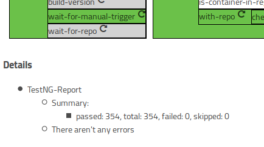

# LambdaCD-TestNG

Clojure library to display TestNG reports at the top of a LambdaCD step.

## Usage

In your project.clj file:
[](http://clojars.org/lambdacd-testng)

In your namespace declaration:
```clojure
(ns myapp.core
  (:require [lambdacd-testng :as testng]))
```

### Create Marathon-Config

Use it in LambdaCD within your build step. For example:
```clojure
(defn compile-to-jar
  [{cwd :cwd {revision :revision} :global} ctx]
  (let [version (str "0.1." (System/currentTimeMillis))
        shell-result (shell/bash ctx cwd (str "ci/buildscripts/build.sh " version " " revision))]
    (assoc shell-result :details [(testng/get-testng-report-as-details "build/reports/tests/testng-results.xml")])))
```

### Screenshots

Test without errors:




Test with errors:

-- coming soon --

## License

Copyright © 2015 OTTO (GmbH & Co. KG)

Distributed under [Apache Public License 2.0](http://www.apache.org/licenses/LICENSE-2.0.html).
